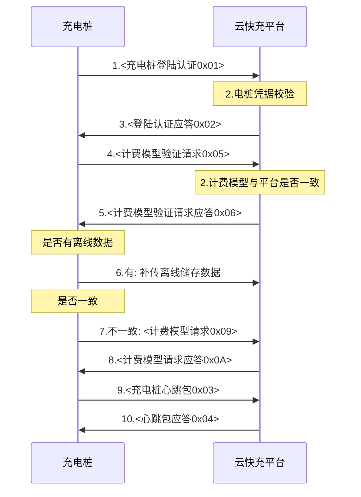
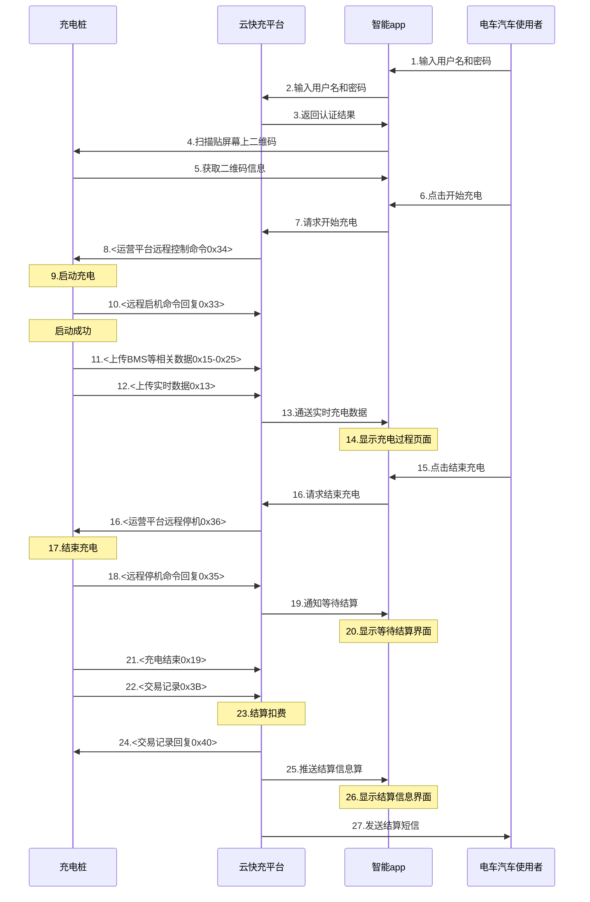
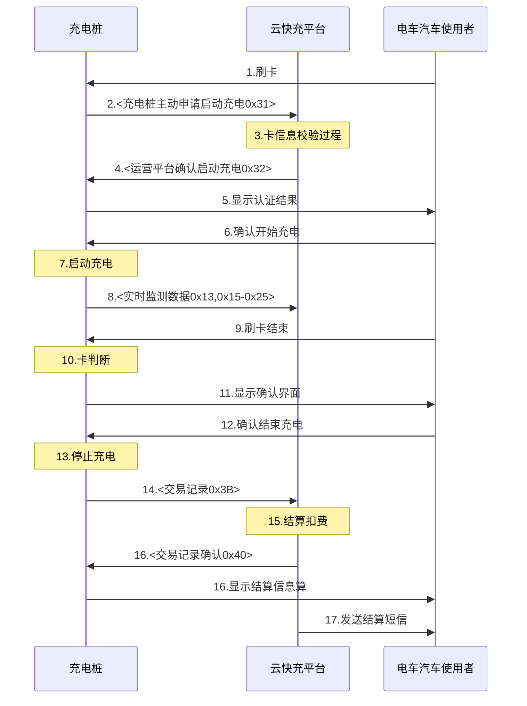

# 上电流程

```mermaid
sequenceDiagram
    participant 充电桩
    participant 云快充平台
    
    充电桩->>云快充平台: 1.<充电桩登陆认证0x01>
    Note over 云快充平台: 2.电桩凭据校验
    云快充平台->>充电桩: 3.<登陆认证应答0x02>
    
    充电桩->>云快充平台: 4.<计费模型验证请求0x05>
    Note over 云快充平台: 2.计费模型与平台是否一致
    云快充平台->>充电桩: 5.<计费模型验证请求应答0x06>
    
    Note over 充电桩: 是否有离线数据
    充电桩->>云快充平台: 6.有: 补传离线储存数据
    
    Note over 充电桩: 是否一致
    充电桩->>云快充平台: 7.不一致: <计费模型请求0x09>
    云快充平台->>充电桩: 8.<计费模型请求应答0x0A>
    
    充电桩->>云快充平台: 9.<充电桩心跳包0x03>
    云快充平台->>充电桩: 10.<心跳包应答0x04>
```

# App 充电流程

```mermaid
sequenceDiagram
    participant 充电桩
    participant 云快充平台
    participant 智能app
    participant 电车汽车使用者
    
    电车汽车使用者->>智能app: 1.输入用户名和密码
    智能app->>云快充平台: 2.输入用户名和密码
    云快充平台->>智能app: 3.返回认证结果
    
    智能app->>充电桩: 4.扫描贴屏幕上二维码
    充电桩->>智能app: 5.获取二维码信息
    
    电车汽车使用者->>智能app: 6.点击开始充电
    智能app->>云快充平台: 7.请求开始充电
    
    云快充平台->>充电桩: 8.<运营平台远程控制命令0x34>
    Note over 充电桩: 9.启动充电
    充电桩->>云快充平台: 10.<远程启机命令回复0x33>
    
    Note over 充电桩: 启动成功
    充电桩->>云快充平台: 11.<上传BMS等相关数据0x15-0x25>
    充电桩->>云快充平台: 12.<上传实时数据0x13>
    云快充平台->>智能app: 13.通送实时充电数据
    Note over 智能app: 14.显示充电过程页面
    
    电车汽车使用者->>智能app: 15.点击结束充电
    智能app->>云快充平台: 16.请求结束充电
    云快充平台->>充电桩: 16.<运营平台远程停机0x36>
    Note over 充电桩: 17.结束充电
    充电桩->>云快充平台: 18.<远程停机命令回复0x35>
    
    云快充平台->>智能app: 19.通知等待结算
    Note over 智能app: 20.显示等待结算界面
    
    充电桩->>云快充平台: 21.<充电结束0x19>
    充电桩->>云快充平台: 22.<交易记录0x3B>
    Note over 云快充平台: 23.结算扣费
    
    云快充平台->>充电桩: 24.<交易记录回复0x40>
    云快充平台->>智能app: 25.推送结算信息算
    Note over 智能app: 26.显示结算信息界面
    
    云快充平台->>电车汽车使用者: 27.发送结算短信
```

# 刷卡充电

```mermaid
sequenceDiagram
    participant 充电桩
    participant 云快充平台
    participant 电车汽车使用者
    
    电车汽车使用者->>充电桩: 1.刷卡
    充电桩->>云快充平台: 2.<充电桩主动申请启动充电0x31>
    Note over 云快充平台: 3.卡信息校验过程
    云快充平台->>充电桩: 4.<运营平台确认启动充电0x32>
    充电桩->>电车汽车使用者: 5.显示认证结果
    电车汽车使用者->>充电桩: 6.确认开始充电
    
    Note over 充电桩: 7.启动充电
    充电桩->>云快充平台: 8.<实时监测数据0x13,0x15-0x25>
    
    电车汽车使用者->>充电桩: 9.刷卡结束
    Note over 充电桩: 10.卡判断
    充电桩->>电车汽车使用者: 11.显示确认界面
    电车汽车使用者->>充电桩: 12.确认结束充电
    
    Note over 充电桩: 13.停止充电
    充电桩->>云快充平台: 14.<交易记录0x3B>
    Note over 云快充平台: 15.结算扣费
    云快充平台->>充电桩: 16.<交易记录确认0x40>
    
    充电桩->>电车汽车使用者: 16.显示结算信息算
    云快充平台->>电车汽车使用者: 17.发送结算短信
```
