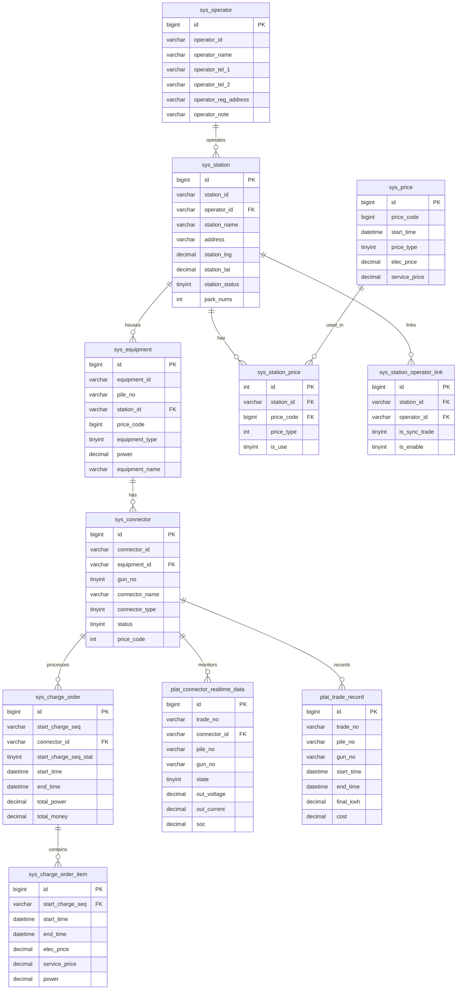
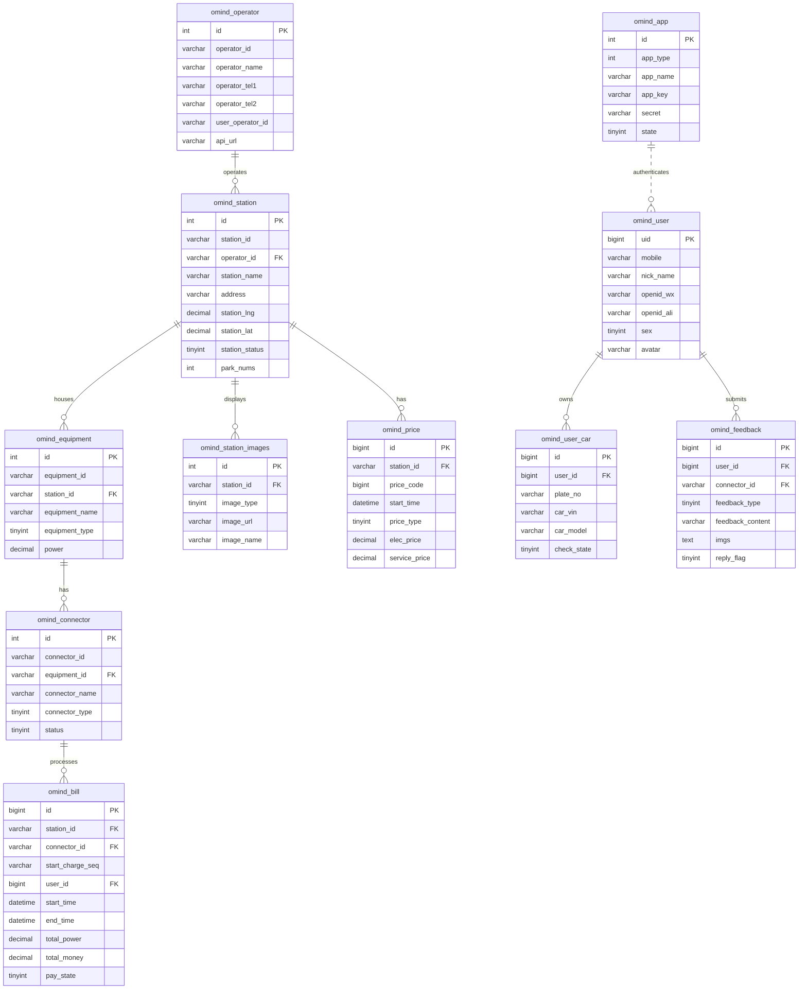

# omind-base-plat

```mermaid
erDiagram
    sys_operator ||--o{ sys_station : operates
    sys_station ||--o{ sys_equipment : houses
    sys_equipment ||--o{ sys_connector : has
    sys_station ||--o{ sys_station_price : has
    sys_station ||--o{ sys_station_operator_link : links
    sys_price ||--o{ sys_station_price : used_in
    sys_connector ||--o{ sys_charge_order : processes
    sys_charge_order ||--o{ sys_charge_order_item : contains
    sys_connector ||--o{ plat_connector_realtime_data : monitors
    sys_connector ||--o{ plat_trade_record : records

    sys_operator {
        bigint id PK
        varchar operator_id
        varchar operator_name
        varchar operator_tel_1
        varchar operator_tel_2
        varchar operator_reg_address
        varchar operator_note
    }

    sys_station {
        bigint id PK
        varchar station_id
        varchar operator_id FK
        varchar station_name
        varchar address
        decimal station_lng
        decimal station_lat
        tinyint station_status
        int park_nums
    }

    sys_equipment {
        bigint id PK
        varchar equipment_id
        varchar pile_no
        varchar station_id FK
        bigint price_code
        tinyint equipment_type
        decimal power
        varchar equipment_name
    }

    sys_connector {
        bigint id PK
        varchar connector_id
        varchar equipment_id FK
        tinyint gun_no
        varchar connector_name
        tinyint connector_type
        tinyint status
        int price_code
    }

    sys_price {
        bigint id PK
        bigint price_code
        datetime start_time
        tinyint price_type
        decimal elec_price
        decimal service_price
    }

    sys_station_price {
        int id PK
        varchar station_id FK
        bigint price_code FK
        int price_type
        tinyint is_use
    }

    sys_station_operator_link {
        bigint id PK
        varchar station_id FK
        varchar operator_id FK
        tinyint is_sync_trade
        tinyint is_enable
    }

    sys_charge_order {
        bigint id PK
        varchar start_charge_seq
        varchar connector_id FK
        tinyint start_charge_seq_stat
        datetime start_time
        datetime end_time
        decimal total_power
        decimal total_money
    }

    sys_charge_order_item {
        bigint id PK
        varchar start_charge_seq FK
        datetime start_time
        datetime end_time
        decimal elec_price
        decimal service_price
        decimal power
    }

    plat_connector_realtime_data {
        bigint id PK
        varchar trade_no
        varchar connector_id FK
        varchar pile_no
        varchar gun_no
        tinyint state
        decimal out_voltage
        decimal out_current
        decimal soc
    }

    plat_trade_record {
        bigint id PK
        varchar trade_no
        varchar pile_no
        varchar gun_no
        datetime start_time
        datetime end_time
        decimal final_kwh
        decimal cost
    }
```
# omind-user-plat

```mermaid
erDiagram
    omind_operator ||--o{ omind_station: operates
    omind_station ||--o{ omind_equipment: houses
    omind_equipment ||--o{ omind_connector: has
    omind_station ||--o{ omind_station_images: displays
    omind_station ||--o{ omind_price: has
    omind_user ||--o{ omind_user_car: owns
    omind_user ||--o{ omind_feedback: submits
    omind_connector ||--o{ omind_bill: processes
    omind_app ||..o{ omind_user: authenticates

    omind_operator {
        int id PK
        varchar operator_id
        varchar operator_name
        varchar operator_tel1
        varchar operator_tel2
        varchar user_operator_id
        varchar api_url
    }

    omind_station {
        int id PK
        varchar station_id
        varchar operator_id FK
        varchar station_name
        varchar address
        decimal station_lng
        decimal station_lat
        tinyint station_status
        int park_nums
    }

    omind_equipment {
        int id PK
        varchar equipment_id
        varchar station_id FK
        varchar equipment_name
        tinyint equipment_type
        decimal power
    }

    omind_connector {
        int id PK
        varchar connector_id
        varchar equipment_id FK
        varchar connector_name
        tinyint connector_type
        tinyint status
    }

    omind_station_images {
        int id PK
        varchar station_id FK
        tinyint image_type
        varchar image_url
        varchar image_name
    }

    omind_price {
        bigint id PK
        varchar station_id FK
        bigint price_code
        datetime start_time
        tinyint price_type
        decimal elec_price
        decimal service_price
    }

    omind_user {
        bigint uid PK
        varchar mobile
        varchar nick_name
        varchar openid_wx
        varchar openid_ali
        tinyint sex
        varchar avatar
    }

    omind_user_car {
        bigint id PK
        bigint user_id FK
        varchar plate_no
        varchar car_vin
        varchar car_model
        tinyint check_state
    }

    omind_feedback {
        bigint id PK
        bigint user_id FK
        varchar connector_id FK
        tinyint feedback_type
        varchar feedback_content
        text imgs
        tinyint reply_flag
    }

    omind_bill {
        bigint id PK
        varchar station_id FK
        varchar connector_id FK
        varchar start_charge_seq
        bigint user_id FK
        datetime start_time
        datetime end_time
        decimal total_power
        decimal total_money
        tinyint pay_state
    }

    omind_app {
        int id PK
        int app_type
        varchar app_name
        varchar app_key
        varchar secret
        tinyint state
    }
```
