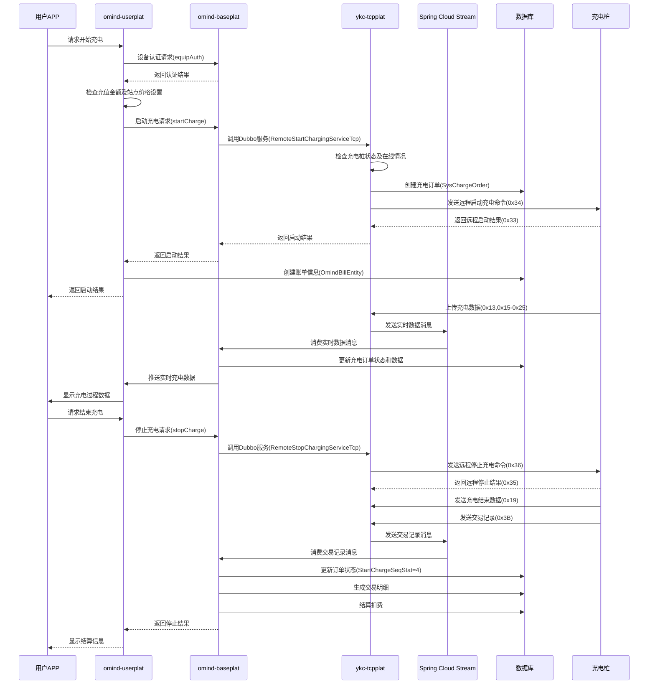

```mermaid
sequenceDiagram
    participant App as 用户APP
    participant UserPlat as omind-userplat
    participant BasePlat as omind-baseplat
    participant TcpPlat as ykc-tcpplat
    participant MQ as Spring Cloud Stream
    participant DB as 数据库
    participant Pile as 充电桩

    App->>UserPlat: 请求开始充电
    UserPlat->>BasePlat: 设备认证请求(equipAuth)
    BasePlat-->>UserPlat: 返回认证结果
    
    UserPlat->>UserPlat: 检查充值金额及站点价格设置
    UserPlat->>BasePlat: 启动充电请求(startCharge)
    BasePlat->>TcpPlat: 调用Dubbo服务(RemoteStartChargingServiceTcp)
    
    TcpPlat->>TcpPlat: 检查充电桩状态及在线情况
    TcpPlat->>DB: 创建充电订单(SysChargeOrder)
    TcpPlat->>Pile: 发送远程启动充电命令(0x34)
    Pile-->>TcpPlat: 返回远程启动结果(0x33)
    TcpPlat-->>BasePlat: 返回启动结果
    
    BasePlat-->>UserPlat: 返回启动结果
    UserPlat->>DB: 创建账单信息(OmindBillEntity)
    UserPlat-->>App: 返回启动结果
    
    Pile->>TcpPlat: 上传充电数据(0x13,0x15-0x25)
    TcpPlat->>MQ: 发送实时数据消息
    MQ->>BasePlat: 消费实时数据消息
    BasePlat->>DB: 更新充电订单状态和数据
    BasePlat->>UserPlat: 推送实时充电数据
    UserPlat->>App: 显示充电过程数据
    
    App->>UserPlat: 请求结束充电
    UserPlat->>BasePlat: 停止充电请求(stopCharge)
    BasePlat->>TcpPlat: 调用Dubbo服务(RemoteStopChargingServiceTcp)
    TcpPlat->>Pile: 发送远程停止充电命令(0x36)
    Pile-->>TcpPlat: 返回远程停止结果(0x35)
    
    Pile->>TcpPlat: 发送充电结束数据(0x19)
    Pile->>TcpPlat: 发送交易记录(0x3B)
    TcpPlat->>MQ: 发送交易记录消息
    MQ->>BasePlat: 消费交易记录消息
    BasePlat->>DB: 更新订单状态(StartChargeSeqStat=4)
    BasePlat->>DB: 生成交易明细
    BasePlat->>DB: 结算扣费
    
    BasePlat-->>UserPlat: 返回停止结果
    UserPlat-->>App: 显示结算信息
```
